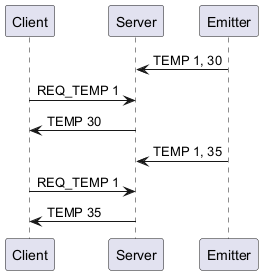
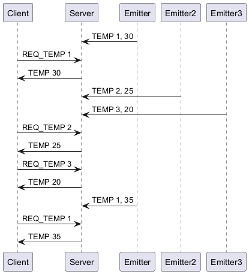
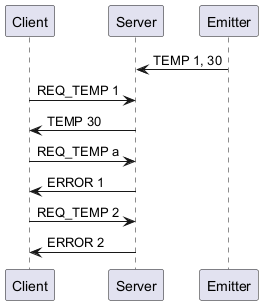
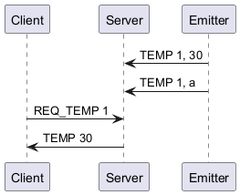
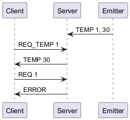

# The getRoomTemp protocol

You are working for an energy company that is interested in monitoring the temperature of its buildings. The company wants to create a new application called _"Temperature monitoring"_.

The application is simple: each room (customizable) has a temperature sensor (an emitter) that emits its own temperature to a receiver (a server).

The server will store the latest temperature of each room.

An operator (client) can connect to the server and request the temperature of a specific room. The server will respond with the temperature of the room.

Here is **one of the possible results**.

> [!NOTE]
> 
> Each person can have a different way to define the protocol. This is one of
> the possible ways to define the protocol. Your might be different and that is
> totally fine. The most important is to define the protocol in a clear and
> explicit way.

## Section 1 - Overview

The getRoomTemp protocol is a communication protocol that allows a client to request the temperature of a specific room.

The server stores the latest temperature of each room.

The emitter sends the temperature of the room to the server using multicast.

## Section 2 - Transport protocol

The guessTheNumber protocol is a text transport protocol. It uses UDP for the fire and forget style of communication. The port it uses has no relevance as long as it's not used by something else.

Every message must be encoded in UTF-8 and delimited by a newline character
(`\n`). The messages are treated as text messages.

There is no initial connection to establish. The client can send a message to the server indicating the room it wants the temperature of. The server will respond with the temperature of the room.

The server's role is to verify if the received room is valid (is it a room?) and return the temperature of the room.

The emitter will intermittently send it's room temperature to the server. The server will store the latest temperature of the room along the room number.

On an unknown message, the server must send an error to the client.

## Section 3 - Messages

### Request temperature

The client sends a message to the server, indicating the room it wants the temperature of.¨

#### Request

```text
REQ_TEMP <room>
```

- `<room>`: the room number the client wants the temperature of

#### Response

- `TEMP <temperature>`: the temperature of the room
- `ERROR <code>`: an error occurred during the request. The error code is an integer between 1 and 1 inclusive. The error codes are as follows:
    - 1: the room number is invalid
    - 2: the room number is not found
    - 3: the temperature is not available

The 3rd case, albeit rare, can happen if the server has somehow lost the temperature of the room. The server must respond with an error in this case.

### Send temperature

The emitter sends a message to the server, indicating the current temperature of the room.

#### Request

```text
TEMP <id> <temperature>
```

- `<id>`: the room number
- `<temperature>`: the temperature of the room

#### Response

None.

## Section 4 - Examples

### Standard use case



### Standard use case with multiple emitters



### Temp request errors



### Emitter errors



### Unknown message

